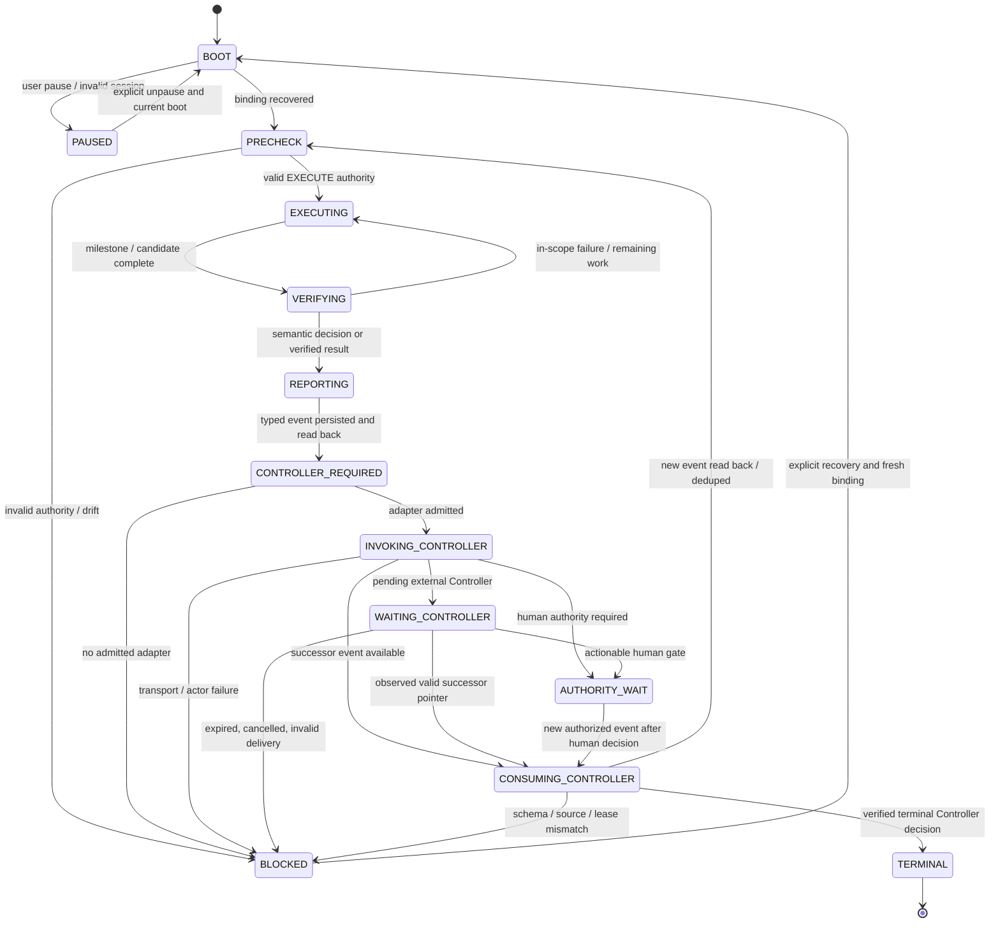

# Hermes Desktop — Unified Runtime Runbook

**Status:** Desktop operating procedure (documentation); implementation and provider transport readiness must be verified separately.
**Scope:** One persistent Hermes Desktop **main session** performs the Executor work. It has **one shared execution lifecycle** and selects **one Controller invocation adapter** for the current run.
**Authority:** This runbook does **not** implement or amend TaskController, grant approval, activate GWC, authorize writes, register a provider adapter, or make either mode immediately executable.

## 1. Canonical sources and mode selection

Before executing, read [root `AGENTS.md`](../../AGENTS.md), `workspace.yaml`, [Controller registry](../../controllers/taskcontroller.yaml), [agent index](../../agents/README.md), [TaskController A2A contract](../../agents/shared/taskcontroller-a2a-protocol.md), and [Hermes Executor instructions](../../agents/hermes/agent-instructions.md). For approved local mutations in a registered submodule also load [Executor worktree policy](../../controllers/executor-worktree-policy.md) and [isolated worktree runbook](ISOLATED_SUBMODULE_WORKTREE.md). Load GWC only when the actual task activates it.

Choose `controller_strategy` **from the admitted Controller identity and communication binding**, not from task complexity, `max_children`, number of test cycles, or operator preference after a failure:

| Strategy | Controller | Invocation | Main Executor |
| --- | --- | --- | --- |
| `standalone` | Separately admitted **in-session logical Controller phase** on Hermes Desktop | Pattern E specialist fanout → MoA (as needed) → verified Controller decision → typed Controller mailbox | Same **one** persistent Hermes Desktop session |
| `coordination` | **GPT Web** in an exact bound in-app-browser thread | Typed Executor event → verified `drive_preview` notification to GPT → Controller transition → successor pointer | Same **one** persistent Hermes Desktop session |

`max_children=0` prohibits **governed Executor child runs** but does not choose Standalone/Coordination. In Standalone, Pattern E specialist Bot Chat calls are **advisory under separately approved Controller-analysis scope**, not Executor child contracts or a new main session. “No outside calls” means **no GPT Web** in Standalone, not network-offline: GitHub mailbox, model and specialist calls may be remote.

**Controller strategy is bound at BOOT.** Moving between strategies or transferring a GPT-bound Controller to an internal Controller requires a new canonical authority/actor/continuation/notification binding transition. Never auto-fallback after preview or fanout failure.

## Controller-first bootstrap boundary (not an Executor PRECHECK)

This document is the **Executor-side** procedure, beginning when an admitted Executor consumes a real Controller command. A fresh run's Controller-owned `UR.G0` / `UR.G1` (or other native understanding/planning stages) may start, complete with native gate evidence and advance **without** a Hermes session, notification adapter, Executor acknowledgement or mailbox dispatch. The Controller decides the native gate owner first; it MUST NOT enter `WAIT_EXECUTOR`, mint a placeholder lease or send a command merely to initialize a new run.

`BOOT / PRECHECK` below applies to **Hermes when it receives an actual Executor-bound request**, and before every protected effect; it does not gate Controller-only planning. At the first real Executor dispatch boundary, the Controller must bind recipient/adapter, use the canonical mailbox/v2 materializer, persist continuation and exact-read event/cursor/continuation before wake-up. The Executor subsequently performs PRECHECK. Missing Desktop Preview or Executor admission blocks **dispatch**, not lawful Controller-only work; `RUN_HOLD` and native gate receipts are never bypassed.

## 2. Shared state machine (both modes)



State meanings:
- **`BOOT` / `PRECHECK`:** Resolve exact mailbox/v2 Controller/Executor events and cursors, immutable continuation, current source/base/head, actor identity, scope, approval, lease-generation/fence and user pause. PRECHECK precedes **every** protected effect, fresh goal and resume.
- **`EXECUTING` / `VERIFYING`:** Use one bounded native Hermes `/goal` when installed support and contract permit. Implement → test → fix → refactor → regression **within the same valid EXECUTE mission**. A recoverable RED/GREEN or lint error is **not** a Controller boundary. `/goal` judge, `last_stop_reason` or loop tick does not prove acceptance.
- **`REPORTING`:** Publish a **typed Executor mailbox/v2** progress/blocker/completion event via the canonical materializer; exact-readback the event, digest/cursor and evidence. No handwritten GitHub JSON, Slack message, Preview text or MoA output substitutes for it.
- **`INVOKING_CONTROLLER`:** **Only strategy-specific step.** Pass the exact already-persisted `executor_event_ref`. An adapter can produce a verified Controller event reference, an actionable authority wait, or an explicit blocker; external asynchronous notification may first yield `WAITING_CONTROLLER`.
- **`CONSUMING_CONTROLLER` / `PRECHECK`:** Exact-read a **newer** Controller event and immutable continuation with correct actor/run/attempt/seq/digest, lease/fence/source/scope/pause before resuming effects. Duplicate notification is no-op; old events cannot replay effects.
- **`AUTHORITY_WAIT` / `BLOCKED` / `PAUSED`:** No protected effects and no silent retry. Human request must be genuinely actionable and owned by the admitted Controller. Recovery requires verified new evidence/authority and an authorized trigger, never an automatic Loop. **Host scheduler paused ≠ TaskController RUN_HOLD ≠ terminal Executor.** Preserve the main session for exact event-driven successor delivery and identify Controller's release action; Loop tick count or `last_stop_reason` is not authority.
- **`TERMINAL`:** Both Executor evidence **and canonical Controller terminal disposition** are verified; otherwise wait for a valid Controller outcome.

### Shared transition invariants

1. **One main session, one active effect writer.** Executor and Controller actor identities/mailbox producer namespaces remain separate, even when both logical phases execute in the same UI session. No overlapping Controller/Executor writers or recursive self-dispatch.
2. **Evidence before notification.** Executor `event+cursor+continuation` is persisted and exact-read back **before** `INVOKING_CONTROLLER`; Controller successor is materialized/read back **before** the Executor resumes.
3. **Effects only while authorized.** Current `EXECUTE` grant, scope, lease/fence, actor/source/head and unpaused state are required. Read-only `PLAN` or advisory fanout never authorizes writes. Merge, separately governed Ready-for-Review, deploy, production, secrets, migration and destructive actions require distinct authority.
4. **Bounded loops.** Self-repair continues under valid `continue_until`, budget and checkpoints; semantic results trigger Controller only when a real boundary/terminal decision occurs. Avoid gratuitous chat churn.
5. **No polling or hidden fallback.** No periodic mailbox polling, Slack machine notifications, browser scraping substitution, `/loop` wakeup, repeated Preview messages or automatic strategy switch.
6. **No infinite unowned wait.** Every Controller invocation either produces a validated successor, remains explicitly pending with a durable owner/correlation/approved transport, resolves to an actionable Human wait, or fails with a recorded blocker. Pending state is not a success claim.
7. **No self-issued authority.** Neither Pattern E/MoA nor a GPT chat reply nor an Executor role-switch can mint Controller identity, approval, lease, fencing or a valid canonical event.

## 3. Common Executor lifecycle and single branching point

```text
Recover exact run + selected controller_strategy
  → BOOT → PRECHECK
  → EXECUTING (/goal) ↔ VERIFYING (test / fix)
  → REPORTING (typed Executor mailbox event + cursor exact-readback)
  → INVOKE_CONTROLLER(executor_event_ref, bound strategy)   ← ONLY BRANCH
  → wait for / receive valid Controller event reference
  → CONSUMING_CONTROLLER → PRECHECK
  → EXECUTING again | AUTHORITY_WAIT | BLOCKED | TERMINAL
```

Conceptual adapter interface (design contract, **not** a deployed SDK):

```text
invoke_controller(
    executor_event_ref,
    controller_strategy,
    actor_binding,
    continuation_ref
) -> CONTROLLER_EVENT_REF | PENDING(correlation, owner, recovery_ref)
   | AUTHORITY_WAIT(actionable_request_ref) | BLOCKED(reason, evidence_ref)
```

The returned `CONTROLLER_EVENT_REF` is **only a pointer**. The main Executor never executes from adapter prose: it must exact-read and validate the actual typed Controller event and durable continuation.

## 4. Controller invocation — two strategies

### A. `standalone`: internal Controller phase + Pattern E → MoA

1. Main Executor **quiesces all effects** and reports exact typed `executor_event_ref`; capture the observed event/cursor/continuation.
2. Switch *operating phase* inside the same Hermes Desktop main session **only if this host is independently admitted as canonical Controller** for this run; Controller and Executor mailbox writes must remain distinct and serialized. A previously GPT-bound run cannot silently switch actors.
3. Controller exact-consumes the Executor event. If specialist analysis is needed and allowed, consult [Pattern E — SlackFanout](https://github.com/nhatnguyenquang1838-coder/hermes-sync/blob/67e332fb2ef3d2cd0e86e0b8f1a20fcf3d235bb6/skills/dwa-a2a-coordination/SKILL.md): `~/.hermes/dw_superapps/fanout.py` fans a scoped task to specialist Bot Chat sessions; optional `/moa` synthesizes **advisory** recommendations. Verify exact repo/SHA/evidence independently. The original script is Slack-ingress oriented; in-session adaptation and installed tool availability remain **unqualified** until on-host E2E.
4. Controller applies **canonical** TaskController gate/admission/Human authority checks and selects one legal next decision. Pattern E does **not** approve effects, extend leases, alter scope or create machine events.
5. If allowed, persist continuation, append typed Controller successor and cursor using runtime-owned components; exact-readback. If Human authority is needed, record an actionable Human request and enter `AUTHORITY_WAIT` without inventing approval.
6. Hand back **only** verified Controller event reference to the main Executor. Revalidate entire PRECHECK before resuming the native goal. If Controller binding/materializer/fanout provider fails, return a truthful blocker; do not call GPT Web or Slack as fallback.

**Source caveat:** The external Pattern E skill includes historic v1 mutable mailbox and Slack/polling instructions; current DW-SuperApps mailbox/v2 + event-driven contracts **take precedence**. Specialist Bot Chat calls are not TaskController child runs under `max_children=0`. The separate Controller-advisory permission must be established; this runbook does not supply it.

### B. `coordination`: GPT Web Controller via in-app-browser / Drive Preview

1. Main Executor first writes and **exact-readbacks** typed Executor mailbox event/cursor, then uses the **qualified and bound** Hermes in-app-browser / `drive_preview` to send a **pointer-only** message to the exact GPT Web Controller thread:

```text
TASKCONTROLLER_EXECUTOR_EVENT_READY
run_id: <canonical run ID>
executor_mailbox_ref: <exact event reference>
executor_seq: <new sequence>
event_digest: <observed digest>
action: Exact-read Executor event; return Controller successor event reference.
```

2. **GPT Web Controller** exact-reads Executor event/evidence with its authorized GitHub access, evaluates the decision and any required Human approval, persists canonical continuation, publishes typed Controller event/cursor via the approved runtime and exact-readbacks it. GPT prose `APPROVED` is **not** authority.
3. The **admitted** Preview response/delivery mechanism signals the successor pointer back to Hermes (or a separately approved event adapter delivers it). Hermes must distinguish transport notification from actual GPT mailbox **consumption**. Do not assume reply delivery, automatic wakeup, or an installed `drive_preview` API without evidence.
4. Main Executor exact-reads the successor Controller event and returns to PRECHECK. If Preview is missing/unbound, GPT cannot consume, or no approved mailbox-v2 notification adapter exists, enter `BLOCKED/TRANSPORT_BLOCKED`; do **not** poll or substitute another browser/Slack.
5. `WAITING_CONTROLLER` is allowed only with a durable pending correlation, real owner and approved return signal. No busy-loop, duplicate send or unbounded repeated GPT calls.

**Contract caveat:** Current [Controller registry](../../controllers/taskcontroller.yaml) requires event-driven mailbox/v2; `hermes-cloud` declares `mailbox-event`. Neither this registry nor this runbook qualifies Hermes **Desktop** Preview as a live notification binding. A separate approved binding/adapter validation is required before real execution in this mode.

## 5. Event-to-event continuity matrix

| Scenario | Shared Runtime | Standalone invocation | Coordination invocation |
| --- | --- | --- | --- |
| Normal TDD failure within scope | Stay `EXECUTING` → repair → verify | **No** Controller call | **No** GPT/Preview call |
| Controller decision genuinely needed | Publish Executor event → `INVOKING_CONTROLLER` | Internal Controller phase; optional Pattern E/MoA; canonical successor | Preview pointer to GPT Web; canonical successor |
| No specialist advice needed | Reuse same reporting/consume path | Controller can decide from evidence without fanout | GPT can decide from evidence |
| Human approval required | `AUTHORITY_WAIT` with actionable request, no effects | Internal Controller asks Human legitimately | GPT Controller asks Human legitimately |
| Adapter unavailable | `BLOCKED`, preserve exact evidence | No impersonated Controller or fake fanout | No browser/Slack/polling fallback |
| Controller busy / no reply | `WAITING_CONTROLLER` only if owned and correlated | No concurrent in-session Controller/Executor active turns | Preview delivery receipt ≠ GPT consumed; no spam |
| Duplicate/stale notification | Dedupe by bound event identity; no re-execution | Reject stale Controller actor/seq | Reject stale GPT reply/event |
| New valid Controller event | `CONSUMING_CONTROLLER` → full PRECHECK | Same Desktop main Executor resumes | Desktop Executor resumes |
| Expired lease / user pause | `PAUSED/BLOCKED`; do not resume | No local self-renewal | No GPT prose bypass |
| Verified mission completion | Typed Executor result then Controller terminal disposition | Internal Controller verifies | GPT Controller verifies |

## 6. Recovery and migration guard

- Resume from **exact** current event/cursor, durable continuation, actor, attempt, lease/fence, branch/head/CI and relevant evidence, never from prior ChatGPT messages, Slack history, Loop ticks or uncommitted local notes.
- Do not mix `dw.taskcontroller.a2a/v1` mutable comments with canonical `dw.taskcontroller.mailbox/v2` append-only typed events. Runtime-owned materializers control sequences/digests.
- For an expired authority or stale fence, the Controller must perform the legal recovery transition and issue a *new* valid event. No automatic `/goal resume`.

  **Controller-host recovery entrypoint (one-shot, not an Executor command):**
  `scripts/taskcontroller_mailbox_recover.py` invokes the canonical
  `recover_high_integrity_session()` with a pinned head SHA and GitHub-backed
  mailbox/continuation stores. Run only under a **separately admitted Controller**
  identity with its existing host-provided `GITHUB_TOKEN`, after validating any
  `RUN_HOLD` restrictions. For the selected run, resolve `--repository`, `--issue`, `--run-id` and `--expected-head-sha` from the live canonical Controller mailbox/continuation. Do not boot the old hard-coded SCRUM-781 issue/run as a default.

  A successful run yields immutable **continuation recovery evidence only**:
  `WAIT_CONTROLLER / RESOLVE_EXECUTION_AUTHORITY`. It does **not** grant G2,
  advance Controller mailbox event/cursor, notify Hermes, or resume T1–T7.
  Afterward, resolve route-specific authority and produce a fresh typed
  execution request with `scripts/taskcontroller_mailbox_materialize.py`
  (again using the admitted Controller runtime), exact-readback, and only then
  deliver via an independently qualified Coordination notification adapter.
  Never use a legacy `APPROVE G2` token as a Universal V2 cursor release.

- Historical E9/E5, expired leases, Loop ticks and `last_stop_reason` values are audit references only. Do not attribute a pause/resume to a user without an actor-bearing event. Reconcile the *current* canonical run from exact mailbox/continuation refs rather than an older host Loop. Never replay an expired command or auto-unpause an obsolete Loop.
- Do not conflate a local provider capability demonstration with a passed governed TaskController E2E or runtime readiness.

## 7. Acceptance criteria and test matrix

### Static contract checks

- [ ] Root + Hermes + agent-index routing point to **this single runbook**; obsolete two-mode runbooks are absent.
- [ ] One shared state machine and Executor execution lifecycle; strategy selection occurs only at `INVOKING_CONTROLLER`.
- [ ] Contract binds strategy, actors, mode-specific transport and no implicit fallback; `max_children=0` is **not** a mode selector.
- [ ] Every Executor event and Controller successor has durable typed mailbox/cursor/continuation readback; identity, digest, source, lease/fence, pause and exact-head guards remain intact.
- [ ] No Controller approval invented from MoA or GPT response, and no uncontrolled periodic mailbox/Preview polling.
- [ ] TaskController mailbox/v2 remains event-driven; no Loop/Heartbeat/cron/browser scheduler polls or wakes C/E, and exact wakeup fields come from the live source chain.
- [ ] Host Goal/Loop/Heartbeat controls do not grant TaskController/GWC lifecycle authority; no local Task TodoList or generic RunState schema is invented.
- [ ] GPT browser transport is used only through an explicitly qualified binding and the existing `dwa-gpt-exchange` procedure.
- [ ] Settlement requires a confirmed real firing with `awaiting_response=true`, one exact-owner `complete_tick`, and fresh readback showing the expected post-state; `false` alone is not historical proof.
- [ ] A Goal/Loop binding pins this runbook's exact commit SHA at bind time; no implicit tracking of a moving `main`.

### Live provider checks (not satisfied by documentation)

1. **Standalone — happy path:** same main session, separately admitted Controller actor, bounded Pattern E/MoA, typed Controller successor, Executor consume and continuation.
2. **Standalone — real boundary:** Human authority request stops mutation; Controller phase cannot self-grant/extend a token or act as concurrent Executor writer.
3. **Coordination — full round trip:** typed Executor result → readback → verified bound `drive_preview` → GPT **exact** consume → valid typed Controller successor → observed return pointer → Hermes re-PRECHECK.
4. **Coordination — missing preview/tool:** deterministic `TRANSPORT_BLOCKED` with persisted evidence and no fallback.
5. **Both — TDD liveness:** multiple in-scope failures repaired without Controller chat turn or `/loop`.
6. **Both — retries:** duplicate/late notifications, expired lease, stale fence and user pause cause **zero repeated effects**.
7. **Both — terminal:** verifiable exact-head tests/artifacts and canonical Controller terminal disposition; no optimistic success from UI/session stop reason.

**Readiness:** Until provider bindings and live tests pass, report **DOCUMENTED / E2E_UNVERIFIED**, not `RUNTIME_READY`.

## Hermes host Loop integration boundary (generic)

This repository runbook governs Desktop runtime/provider behavior and its TaskController integration. It is not a second Hermes host-scheduler manual or TaskController/GWC contract. Use the local `hermes-loop-operations` skill for native Goal/Loop/Heartbeat mechanics and `dwa-gpt-exchange` for GPT browser transport; both are procedure aids subordinate to the live DW-SuperApps and applicable GWC source chains.

- **Host-control ownership:** `GoalManager`, `LoopManager`, and `HeartbeatManager` control only their respective native scheduler rows. They do not grant repository, mailbox, gate, or human authority.
- **Source-owned lifecycle:** use the active project's declared lifecycle state/cursor and typed `NEXT`. This runbook does not define a universal `RunState`, `RuntimePlan`, `Task TodoList`, `DONE`/predecessor rule, or `validity_key`. Do not invent local C/E cursor or deadlock predicates; follow the exact current protocol records.
- **Event-driven mailbox boundary:** canonical mailbox/v2 is event-driven. Never use `/loop`, `/heartbeat`, cron, Slack polling, browser scraping, or another scheduler to poll C/E or wake the Controller. Use exact live-schema field names (including `periodic_mailbox_polling` and `wakeup_binding` where defined, plus typed per-run permissions); when polling or Executor wakeup is forbidden, do not keep, re-arm, or resume **that forbidden polling scheduler**. Classify the Loop's exact run binding first: a paused obsolete or mailbox-polling Loop is NOT a stopped Executor session. Preserve the main Executor session and Controller's event-driven recovery. Authorized engineering work continues without timer-based C/E polling, while expired leases block effects and require a fresh Controller dispatch. Never auto-unpause a stale Loop.
- **Expired lease/fence:** recovery remains Controller-owned. The Executor must not renew a lease/fence, invoke recovery/materialization, or create a successor event/cursor. A recovery receipt alone is not a typed execution grant.
- **Browser transport:** only use a GPT browser route when the active strategy/registry binds a qualified adapter and exact conversation. Otherwise keep `TRANSPORT_BLOCKED`; do not use a fallback or infer delivery from UI output. The exact stage/submit/readback flow belongs to `dwa-gpt-exchange`.
- **Optional advisory analysis:** if an active contract requests one MoA review of a source-bound deadlock fact block, it is advisory only; empty/partial/provider-failed output is `INCONCLUSIVE`. It cannot create a mailbox event, grant authority, decide a source-owned cursor predicate, or perform lease recovery.
- **Loop continuity:** first evaluate the pure `taskcontroller.controlplane.orchestration_policy.decide_executor_loop_continuity()` guard using the live run/Loop binding, hold type, validated EXECUTE contract and event adapter. `scheduler_action` refers only to the host row; `executor_session_action` and `typed_next` separately identify persistent Executor/session status and current owner. The guard does not call `LoopManager.pause()` or `resume()`, grant authority, or create an event. A Loop bound to a different run is quarantined, not adopted/restarted.
- **Loop settlement:** for a confirmed real firing only, exact-read the same owner/session and create/verify the required pre-settlement backup. Call `LoopManager(session_id).complete_tick(last_response)` exactly once only when that firing has `awaiting_response=true`; then use a fresh manager readback to verify the same firing and `awaiting_response=false` as the postcondition. A paused Loop or pre-settlement `false` means no current firing to settle and does not prove historical settlement. Never replay, backfill, or synthesize a tick or backup.
- **Binding:** when a native Goal/Loop contract explicitly binds this runbook, record its exact repo commit SHA at binding time and keep that revision fixed for the run. Do not silently follow moving `main`; a document change does not mutate native manager state or rebind a live run.
